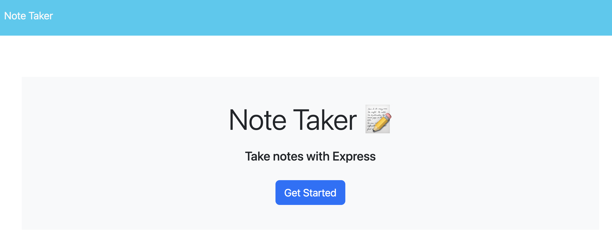

# Note-Taker

# Note Taker

## Description
This project allows you to enter notes in and safe them.

## Table of Contents
- [Usage](#usage)
- [Licesnse](#license)
- [Questions](#questions)

## Screenshot

## Usage
Enter notes in and use button in upper right hand corner to save.

## License
- MPL_2.0
- Link: https://opensource.org/license/mpl-2-0/   

## Questions
- Github username: gadams45
- Email address: gadams8340@gmail.com
      